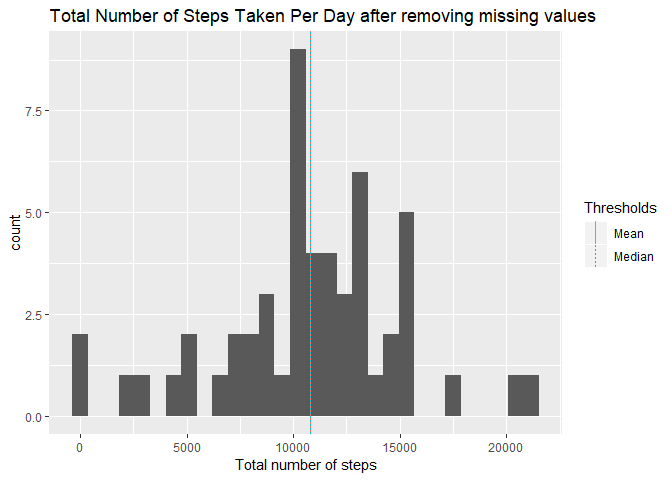
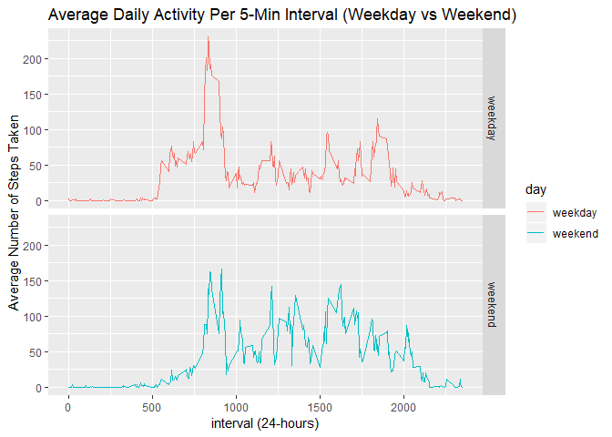

## Loading and preprocessing the data
unzip activity.zip to get a csv file.


```r
unzip("activity.zip", exdir="data")
```

Reading the data into activity data frame and show statistics

```r
activity <- read.csv("data/activity.csv", header = TRUE)

activity$date <- as.Date(as.character(activity$date))
str(activity)
```

```
## 'data.frame':	17568 obs. of  3 variables:
##  $ steps   : int  NA NA NA NA NA NA NA NA NA NA ...
##  $ date    : Date, format: "2012-10-01" "2012-10-01" ...
##  $ interval: int  0 5 10 15 20 25 30 35 40 45 ...
```

```r
summary(activity)
```

```
##      steps             date               interval     
##  Min.   :  0.00   Min.   :2012-10-01   Min.   :   0.0  
##  1st Qu.:  0.00   1st Qu.:2012-10-16   1st Qu.: 588.8  
##  Median :  0.00   Median :2012-10-31   Median :1177.5  
##  Mean   : 37.38   Mean   :2012-10-31   Mean   :1177.5  
##  3rd Qu.: 12.00   3rd Qu.:2012-11-15   3rd Qu.:1766.2  
##  Max.   :806.00   Max.   :2012-11-30   Max.   :2355.0  
##  NA's   :2304
```


## What is mean total number of steps taken per day?

The histogram shows that the mean and the median total number of steps taken per day cannot be distinguished by the plot because the red line and the dashed blue line are aligned together.

```r
library(plyr)
library(ggplot2)

stepsPerDay <- ddply(activity, "date", summarise, totalSteps = sum(steps))

cuts1 <- data.frame(Thresholds="Mean", vals = mean(stepsPerDay$totalSteps, na.rm=T))
cuts2 <- data.frame(Thresholds="Median", vals = median(stepsPerDay$totalSteps, na.rm=T))
cuts <- rbind(cuts1,cuts2)

ggplot(data = stepsPerDay, aes(x = stepsPerDay$totalSteps)) + geom_histogram() + 
    geom_vline(data=cuts, aes(xintercept=vals, linetype=Thresholds, colour = Thresholds),show.legend = TRUE) + 
    xlab("Total number of steps") + ggtitle("Total Number of Steps Taken Per Day after removing missing values")
```

```
## Warning: Removed 8 rows containing non-finite values (stat_bin).
```

<!-- -->

```r
mean(stepsPerDay$totalSteps, na.rm=T)
```

```
## [1] 10766.19
```

```r
median(stepsPerDay$totalSteps, na.rm=T)
```

```
## [1] 10765
```

## What is the average daily activity pattern?
First, I construct a time series plot of the 5-minute interval (x-axis) and the average number of steps taken, averaged across all days (y-axis).

```r
intervalavg <- ddply(activity, "interval", summarise, avgSteps = mean(steps, na.rm=T))

summary(intervalavg)
```

```
##     interval         avgSteps      
##  Min.   :   0.0   Min.   :  0.000  
##  1st Qu.: 588.8   1st Qu.:  2.486  
##  Median :1177.5   Median : 34.113  
##  Mean   :1177.5   Mean   : 37.383  
##  3rd Qu.:1766.2   3rd Qu.: 52.835  
##  Max.   :2355.0   Max.   :206.170
```
The 5-minute interval, on average across all the days in the dataset, that contains the maximum number of steps is at interval 835.

```r
intervalavg[which.max(intervalavg$avgSteps),]
```

```
##     interval avgSteps
## 104      835 206.1698
```
## Imputing missing values
Number of missing values

```r
averages <- aggregate(x=list(steps=activity$steps), by=list(interval=activity$interval), mean, na.rm=TRUE)

fill_value <- function(steps, interval) {
    filled <- NA
    if (!is.na(steps))
        filled <- c(steps)
    else
        filled <- (averages[intervalavg$interval==interval, "steps"])
    return(filled)
}
activityFilled <- activity
activityFilled$steps <- mapply(fill_value, activityFilled$steps, activityFilled$interval)
```
After filling in the missing values, the calculation reveals that the mean and median total number of steps taken per day is 10766 steps.

```r
stepsPerDayFilled <- ddply(activityFilled, "date", summarise, totalSteps = sum(steps))
mean(stepsPerDayFilled$totalSteps)
```

```
## [1] 10766.19
```

```r
median(stepsPerDayFilled$totalSteps)
```

```
## [1] 10766.19
```


## Are there differences in activity patterns between weekdays and weekends?

constructing weekdays and weekends pattern

```r
dayofWeek <- ifelse(weekdays(activityFilled$date)=="Saturday" | weekdays(activityFilled$date)=="Sunday","weekend","weekday")
activityFilled$day <- as.factor(dayofWeek)

dayActivity <- ddply(activityFilled, c("interval","day"), summarise, avgSteps=mean(steps))

ggplot(dayActivity, aes(interval, avgSteps)) + geom_line(aes(colour=day)) + facet_grid(day ~ .) + 
    ggtitle("Average Daily Activity Per 5-Min Interval (Weekday vs Weekend)") + xlab("interval (24-hours)") + 
    ylab("Average Number of Steps Taken")
```

<!-- -->

According to the time series plot, the user was more active on the weekdays during the morning between the interval 800 and 1000 than on the weekends. The plot also indicates that the user was typically an early-riser since the activity usually began after the time interval 500. However, perhaps because the user had to work, the activity level was higher on the weekends in the time interval after 1000.
